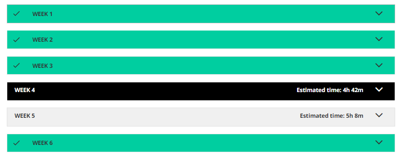

## Ontwikkeling

### SCRUM
[SCRUM in eigen woorden (pdf)](producten/ontwikkeling/SCRUM_opdracht.pdf){:target="_blank"}

### DATACAMP Opdrachten

### Coursera Opdrachten
Van Coursera heb ik week 1, 2, 3 en 4 doorlopen.

### Python ExploratoryDataAnalysis opdrachten
[Map met ExploratoryDataAnalysis Notebooks](https://github.com/Hans2131/Portfolio14137879/tree/master/producten/ontwikkeling/ExploratoryDataAnalysis){:target="_blank"}

### Python tutorial_spark opdrachten
[Map met tutorial_spark Notebooks](https://github.com/Hans2131/Portfolio14137879/tree/master/producten/ontwikkeling/tutorial_spark){:target="_blank"}

### Calling Bullshit
[Opdracht bullshit (pdf)](producten/ontwikkeling/Opdracht_bullshit.pdf){:target="_blank"}
