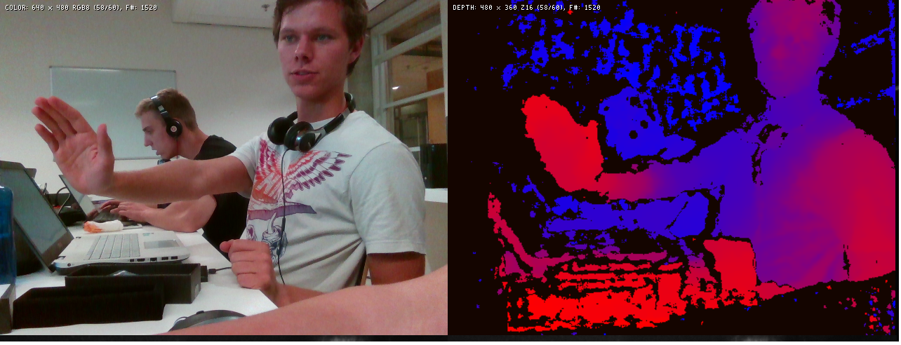
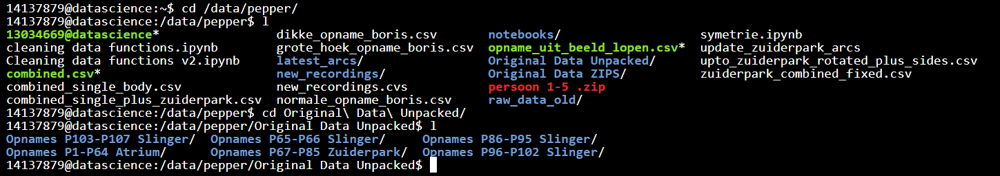

## Werkzaamheden voor Pepper project

### Werken met Intel ZR300
De eerste twee weken van het prject heb ik gewerkt met de RealSense ZR300 dieptecamera. Omdat we uiteindelijke tot de conclusie kwamen dat we de camera niet konden gebruiken zijn hier geen producten uit voorgekomen. Wat heb ik tijdens deze weken gedaan:
- ZR300 op Window werkend gekregen, we dachten eerst dat we  alleen op Linux konden werken met de ZR300
- Zoveel mogelijk informatie, documentatie en code over de ZR300 verzamelen
- De OpenCV librarie werkend proberen te krijgen met de ZR300, hierbij geen succes gehad

### Keuze voor Kinect
Tijdens het werken met de ZR300 kwamen we er als projectgroep achter dat de ZR300 niet goed ondersteunt werd met software die functionaliteit biedt die wij nodig hadden. Ik ben daarom op zoek gegaan naar alternatieven en kwam daarmee uit op de Kinect. De argumenten en informatie voor het gebruik van de Kinect heb ik verwerkt in een document.

[Kinect vs RealSense (pdf)](producten/werkzaamheden/Kinect_vs_RealSense.pdf){:target="_blank"}

### Applicatie voor Kinect
Dit is het product waar ik tijdens het project verantwoordelijk voor ben geweest, en waar ik de meeste tijd in heb gestoken. Onderstaande link verwijst naar een pagina waar ik per deel functionaliteit kort beschrijf wat ik aan de applicatie heb toegevoegd. De applicatie is gebouwd met C#, de andere link verwijst naar de github waar alle source code op staat. Het project op deze github kan eventueel geopend worden met Visual Studio 2017.

[Beschrijving toegevoegde functionaliteit Kinect applicatie](producten/werkzaamheden/kinecting_pepper.md){:target="_blank"}

### Opnemen Kinect Data
Omdat ik het grootste deel van de opname applicatie gemaakt heb wist ik hier tijdens het project ook het meeste van af. Dit maakte mij tijdens de opnamesessies de aangewezen persoon om mensen op te nemen. Overigens was de applicatie wel zo gemaakt dat ook andere zonder al te veel kennis gebruik konden maken van de applicatie. Ik was verantwoordelijk voor opnames (bediening van applicatie) tijdens de volgende opnamesessies, bij elkaar was ik betrokken bij ongeveer 70% van de opnames:
- Verschillende testen voor de projectgroep zelf
- Opnamesessie in het Atrium
- Opnamesessies van scholieren die zelfstandig naar het lokaal kwam als reactie op bericht blackboard

#### Organiseren data op server
Eén van de problemen waar ik tijdens het project tegen aan liep was het feit dat de data die we verzamelden niet echt georganiseerd op de server gezet werden. Om die reden heb ik de dat op de server per opname sessie in een folder gezet.

Daarnaast heb ik een handleiding gemaakt voor het toevoegen van nieuwe data op de server.

[Link handleiding data (pdf)](producten/werkzaamheden/Handleiding_uploaden_data.pdf){:target="_blank"}

#### Cleaning van data met python
De data van een opname bevatten veel overbodige frames, dit komt doordat op het moment dat de opname met de applicatie gestart wordt de oefening niet direct begint. Mijn code verwijdert deze overbodige frames op basis van data uit een excel file. Dit betekent dat projectgenoten alleen de start en eind frames van een oefening in een excellijst hoefden te zetten en mijn script hoefden te runnen. Later is mijn code door andere klasgenoten licht aangepast zodat het met meerdere excel sheets overweg kon.

[Link naar notebook](https://github.com/Hans2131/Portfolio14137879/blob/master/producten/werkzaamheden/Cleaning%2Bdata%2Bfunctions%2Bv2.ipynb){:target="_blank"}

#### Pepper treintje

